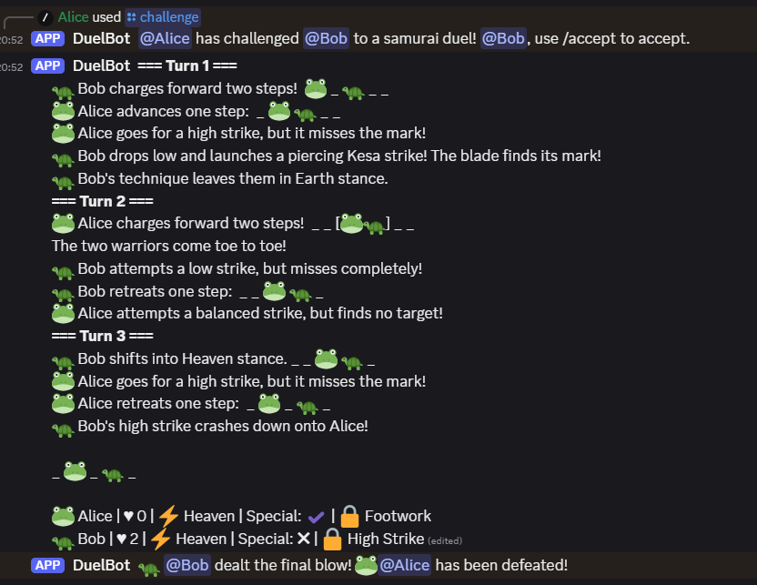
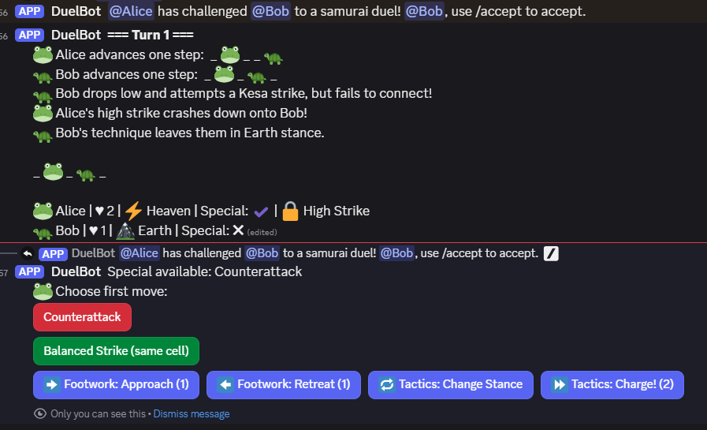

# Duelbot

A Discord bot that implements Kiri-ai (https://boardgamegeek.com/boardgame/387769/kiri-ai-the-duel), a turn-based samurai dueling game. Players challenge each other to tactical combat on a linear board using cards to represent movement, attacks, and stance changes.

Add it to your server here: https://discord.com/oauth2/authorize?client_id=1160688239577931796&permissions=2048&integration_type=0&scope=bot+applications.commands

Game Designer: Kamibayashi
Publishers: Mugen Gaming (JP), Lucky Duck Games (US)

## Features

- **Discord.py bot** with slash commands for issuing and accepting challenges
- **SQLite database** stores player stats, configured channels, and chosen player avatar emojis
- **Lobby System** tracks issued challenges, can run multiple games across multiple servers simultaneously
- **Interactive UI** using Discord buttons for card selection during matches

## Commands

| Command | Description |
|---------|-------------|
| `/usechannel` | Set the channel in which duel commands are enabled |
| `/challenge @user` | Challenge another user to a duel |
| `/accept` | Accept your most recent challenge |
| `/rules` | Display the game rules |
| `/stats` | View your duel statistics |
| `/setemoji <emoji>` | Set your champion emoji |

## Setup

1. Install dependencies: `pip install -r requirements.txt`
2. Set environment variable `DUELBOT_TOKEN` with your Discord bot token
3. Run: `python main.py`

## Screenshots

*Full log of a completed game*

*Controls shown during the game*
